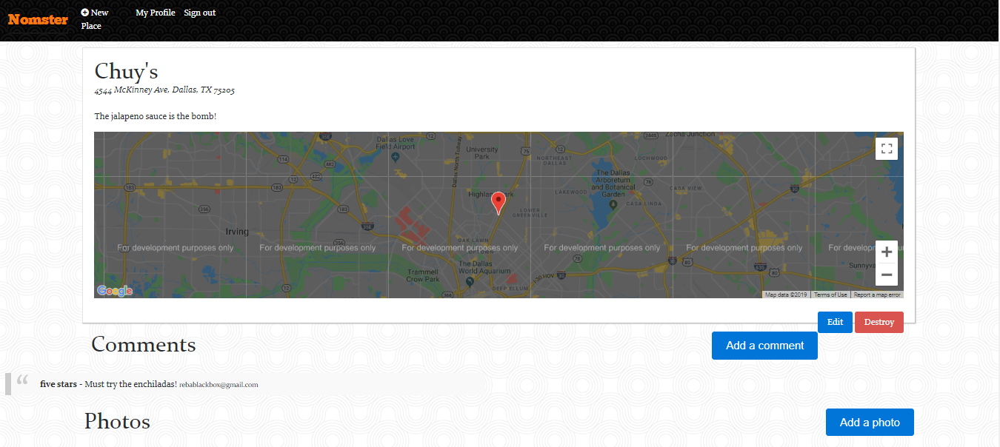
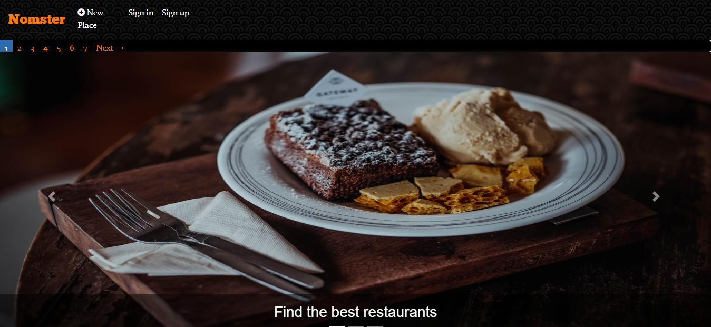
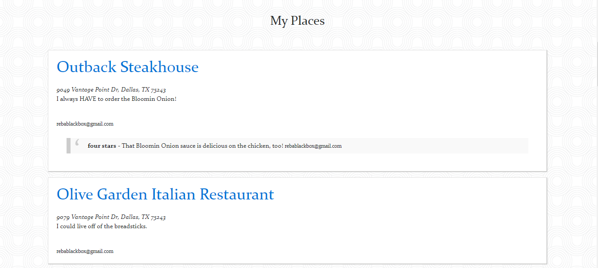
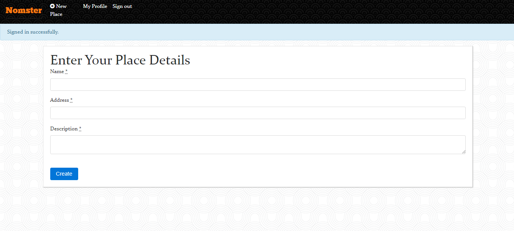
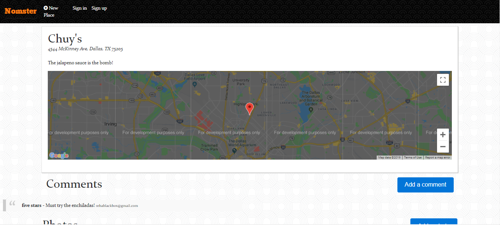
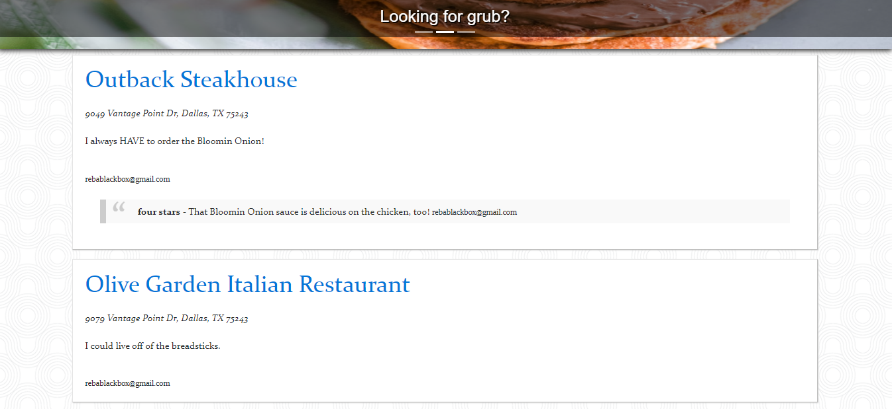
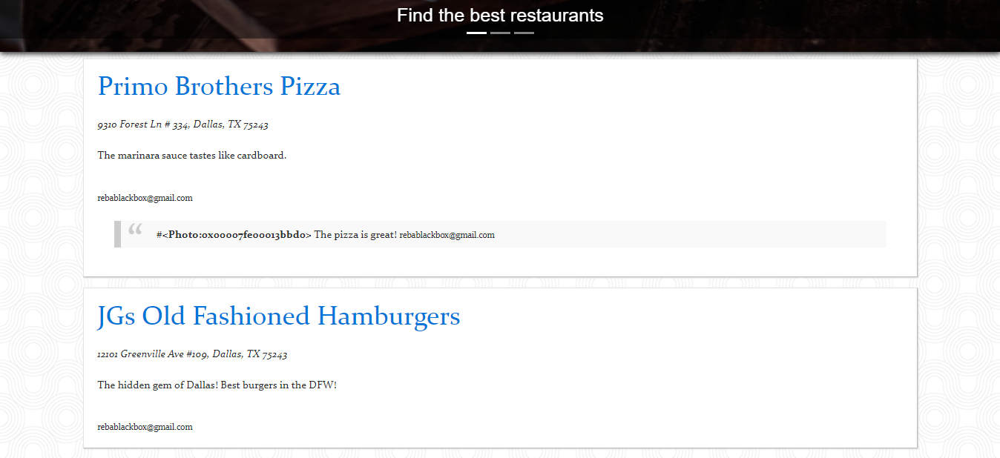
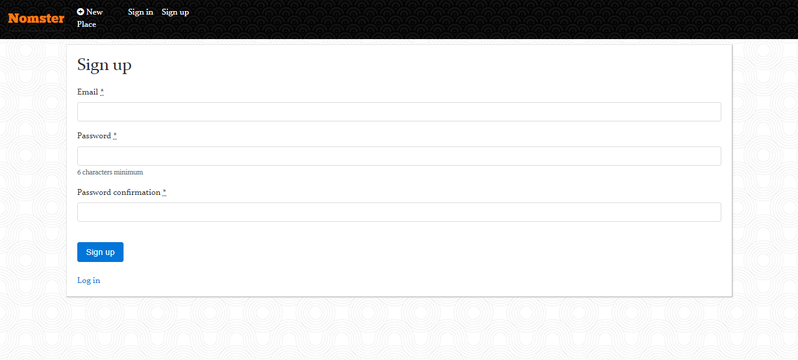
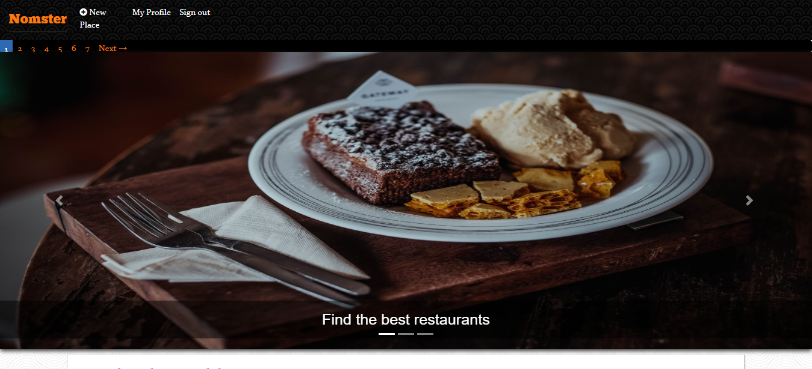
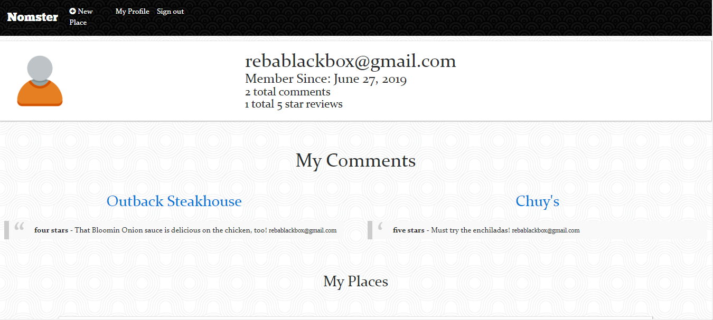

# Nomster

Nomster is a Yelp clone that integrates with the Google Maps API and includes features like user comments, star ratings, image uploading, and user authentication.

## Getting Started

Built using Ruby on Rails

## Deployment

Deployed using Heroku (https://www.heroku.com)

## Testing

Please use Heroku link for testing and viewing purposes (see below)

## Built With

* Ruby on Rails
* Google API
* AWS / S3

## Meta

Reba Pipes

Email: pipes.reba@gmail.com

LinkedIn: (https://linkedin.com/in/rebapipes)

GitHub: (https://github.com/rebapipes/nomster)

Heroku: (https://nomster-reba-pipes.herokuapp.com)

Portfolio: (https://rebapipes.netlify.com)

Medium Blog: (https://medium.com/@rebapipes) 