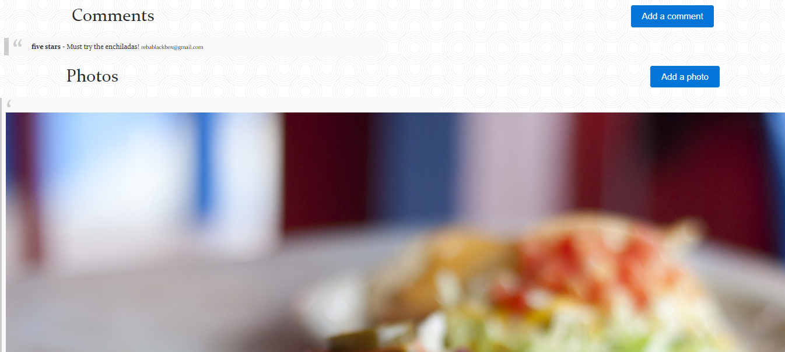

# Nomster

Nomster is a Yelp clone that integrates with the Google Maps API and includes features like user comments, star ratings, image uploading, and user authentication. Uses Git and GitHub for version control, and deployed via Heroku.

Home/Landing Page

Home/Landing Page Continued

Home/Landing Page Continued

My Places (User View)

New Place

Place Details

Place Details Continued

Places (Non-User View)

Places Continued (Non-User View)

Edit or Destroy Place(s)

Signup

View of logged-in user

User Profile

## Getting Started

* Clone the repository
* Run bundle install
* Create and migrate the PotgreSQL database with rake db:create and rake db:migrate
* Start the server using rails server -b 0.0.0.0 -p 3000
* Run the app on localhost:3000

### Prerequisites

* Rails v. 5.0.0
* Ruby v. 2.6.3
* PostgreSQL
* HTML
* CSS/SCSS

## Deployment

Deployed using Heroku (https://www.heroku.com)

* Navigate to https://nomster-reba-pipes.herokuapp.com
* Use guest login or signup
* Guest login information:
    Email/Username: testemail@testing.com
    Password: 123456

## Built With

* Ruby on Rails
* Google Maps API
* Amazon Web Services API (AWS/S3)

## Features

* User authenitcation (Devise)
* User profile(s)
* Image uploading
* Commenting
* Star ratings
* Google Maps API
* Amazon Web Services API (AWS/S3)

## Meta

Reba Pipes

Email: pipes.reba@gmail.com

LinkedIn: (https://linkedin.com/in/rebapipes)

GitHub: (https://github.com/rebapipes/nomster)

Heroku: (https://nomster-reba-pipes.herokuapp.com)

Portfolio: (https://rebapipes.netlify.com)

Medium Blog: (https://medium.com/@rebapipes)

## Contributing

Reba Pipes (https://github.com/rebapipes)

## Versioning

Git & GitHub used for versioning (https://github.com/) 

## Authors

Reba Pipes (https://github.com/rebapipes)

## License

This project is licensed under the MIT License - see the [LICENSE.md](LICENSE.md) file for details